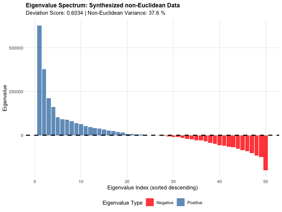
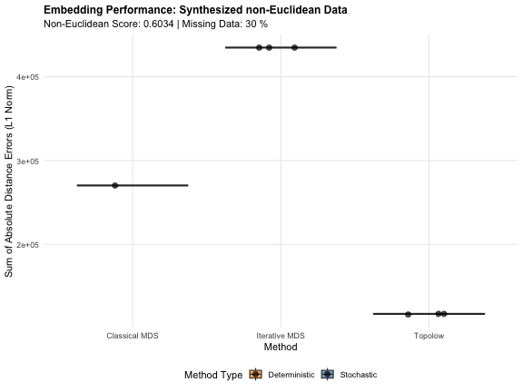
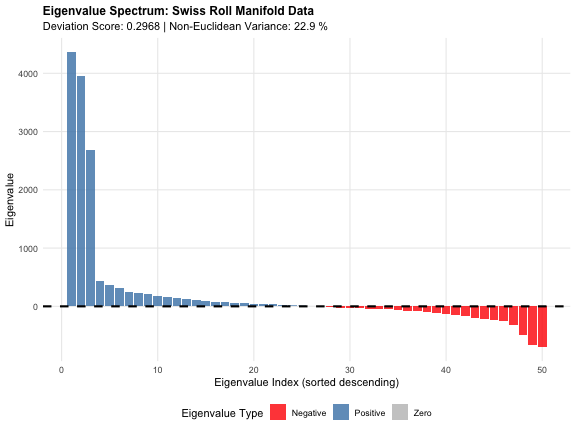
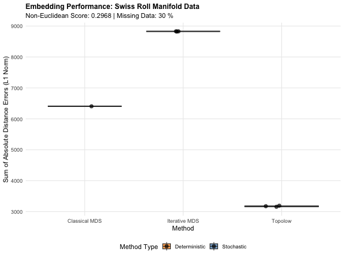
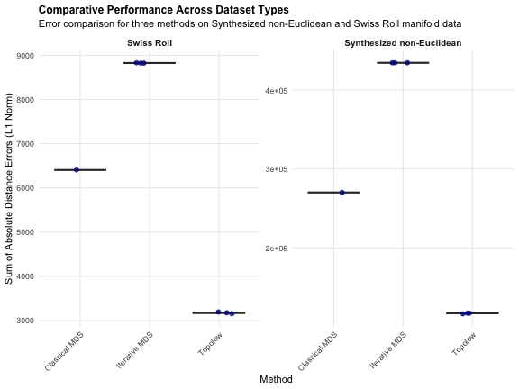
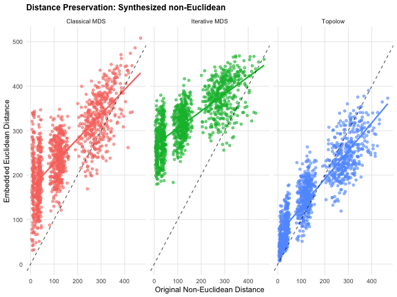
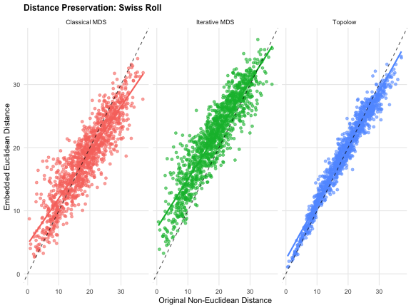

```{r setup, include=FALSE}
knitr::opts_chunk$set(
  echo = TRUE, 
  warning = FALSE, 
  message = FALSE,
  fig.width = 8, 
  fig.height = 6,
  collapse = TRUE,
  comment = "#>",
  cache = FALSE
)
library(topolow)

# Function to check and load packages with informative messages
check_and_load_package <- function(package_name) {
  if (!requireNamespace(package_name, quietly = TRUE)) {
    message("Package ", package_name, " not found. Please install it with:")
    message("install.packages('", package_name, "')")
    return(FALSE)
  } else {
    library(package_name, character.only = TRUE)
    return(TRUE)
  }
}

# Load required libraries
required_packages <- c("topolow", "ggplot2", "dplyr", "reshape2", 
                      "scales", "MASS")

# Check for optional packages
optional_packages <- c("smacof", "RANN")

missing_packages <- character(0)
for(pkg in required_packages) {
  if(!check_and_load_package(pkg)) {
    missing_packages <- c(missing_packages, pkg)
  }
}

# Load optional packages quietly
for(pkg in optional_packages) {
  check_and_load_package(pkg)
}

if(length(missing_packages) > 0) {
  stop("Please install missing packages: ", paste(missing_packages, collapse = ", "))
}

# Set seed for reproducibility
set.seed(42)
```

# Abstract

This vignette presents a comprehensive comparative analysis of embedding methods for non-Euclidean dissimilarity data, with particular focus on the Topolow algorithm. We evaluate three fundamentally different approaches: Topolow (force-directed optimization), Classical Multidimensional Scaling (eigenvalue decomposition), and Iterative MDS (STRESS minimization) across two distinct types of non-Euclidean datasets. Our analysis demonstrates the relative strengths and limitations of each method when dealing with incomplete, non-metric dissimilarity matrices that violate fundamental assumptions of Euclidean geometry.

# Introduction

The embedding of high-dimensional or non-metric dissimilarity data into low-dimensional Euclidean spaces is a fundamental problem in computational statistics, bioinformatics, and machine learning. While classical methods such as Multidimensional Scaling (MDS) provide theoretically optimal solutions under ideal conditions, real-world datasets often exhibit characteristics that challenge these assumptions: sparse measurements, non-Euclidean geometry, and threshold-censored observations.

The Topolow algorithm represents a novel approach to this problem, utilizing physics-inspired force-directed optimization to handle these challenging data characteristics naturally. This vignette provides a rigorous comparative evaluation of Topolow against established methods using controlled synthetic datasets that exhibit known non-Euclidean properties.

## Methodological Framework

We evaluate three distinct embedding approaches:

1. **Topolow**: A force-directed method that models objects as particles connected by springs (for measured dissimilarities) and subject to repulsive forces (for missing measurements)
2. **Classical MDS**: The mathematically optimal eigenvalue-based solution that provides the theoretical best-case Euclidean approximation
3. **Iterative MDS**: A gradient-based STRESS minimization approach that uses stochastic optimization similar to Topolow

This three-method comparison allows us to understand both the theoretical limits of embedding accuracy and the practical differences in optimization stability between deterministic and stochastic methods.

```{r utility_functions, eval=FALSE}
# Enhanced statistical testing with effect sizes
enhanced_statistical_comparison <- function(topolow_errors, other_errors, method_name) {
  valid_topolow <- topolow_errors[!is.na(topolow_errors)]
  valid_other <- other_errors[!is.na(other_errors)]
  
  if(length(valid_other) < 2 || length(valid_topolow) < 2) {
    cat("Insufficient data for statistical comparison with", method_name, "\n")
    return(NULL)
  }
  
  # T-test
  t_result <- t.test(valid_topolow, valid_other)
  
  # Effect size (Cohen's d)
  pooled_sd <- sqrt(((length(valid_topolow) - 1) * var(valid_topolow) + 
                     (length(valid_other) - 1) * var(valid_other)) / 
                    (length(valid_topolow) + length(valid_other) - 2))
  
  cohens_d <- (mean(valid_topolow) - mean(valid_other)) / pooled_sd
  
  cat("\n--- Statistical Comparison (Topolow vs", method_name, ") ---\n")
  cat("- Welch's t-statistic:", round(t_result$statistic, 3), "\n")
  cat("- p-value:", format(t_result$p.value, scientific = TRUE, digits = 3), "\n")
  cat("- Cohen's d (effect size):", round(cohens_d, 3), "\n")
  cat("- Effect size interpretation:", 
      if(abs(cohens_d) < 0.2) "Negligible" 
      else if(abs(cohens_d) < 0.5) "Small"
      else if(abs(cohens_d) < 0.8) "Medium" 
      else "Large", "\n")
  
  return(list(t_test = t_result, cohens_d = cohens_d))
}

# Calculate data quality metrics
calculate_data_quality_metrics <- function(distance_matrix) {
  total_possible <- nrow(distance_matrix) * (nrow(distance_matrix) - 1) / 2
  total_available <- sum(!is.na(distance_matrix[upper.tri(distance_matrix)]))
  completeness <- total_available / total_possible
  
  available_distances <- distance_matrix[!is.na(distance_matrix)]
  
  metrics <- list(
    completeness = completeness,
    n_objects = nrow(distance_matrix),
    n_available_distances = total_available,
    distance_range = range(available_distances),
    distance_mean = mean(available_distances),
    distance_sd = sd(available_distances),
    distance_cv = sd(available_distances) / mean(available_distances)
  )
  return(metrics)
}

# Coordinate validation
validate_coordinates <- function(coords, method_name, n_objects, target_dims) {
  if(is.null(coords)) {
    cat("WARNING:", method_name, "returned NULL coordinates\n")
    return(FALSE)
  }
  if(any(!is.finite(coords))) {
    cat("WARNING:", method_name, "has non-finite coordinates\n")
    return(FALSE)
  }
  if(nrow(coords) != n_objects || ncol(coords) != target_dims) {
    cat("WARNING:", method_name, "has incorrect dimensions\n")
    return(FALSE)
  }
  return(TRUE)
}

# Missing data imputation
improved_missing_data_imputation <- function(dist_matrix) {
  available_distances <- dist_matrix[!is.na(dist_matrix)]
  if(length(available_distances) == 0) {
    median_distance <- 1.0
  } else {
    median_distance <- median(available_distances, na.rm = TRUE)
  }
  dist_matrix[is.na(dist_matrix)] <- median_distance
  return(list(matrix = dist_matrix, imputation_value = median_distance))
}
```

# Data Generation Methodologies

We employ two distinct data generation methods to create non-Euclidean datasets with controlled properties, allowing for systematic evaluation of embedding performance under different types of geometric violations.

## Method 1: Synthesized non-Euclidean Space

This approach creates non-Euclidean data by systematically distorting a high-dimensional clustered dataset through non-linear transformations and asymmetric noise injection.

```{r distorted_euclidean_generator, eval=FALSE}
#' Generate Non-Euclidean Data by Distorting Clustered Points
#'
#' Creates non-Euclidean data through systematic distortion of clustered high-dimensional points.
#' This method is particularly effective for testing robustness to violations of the triangle inequality.
#'
#' @param n_objects Number of objects to generate
#' @param initial_dims Dimensionality of the initial latent space
#' @param n_clusters Number of clusters to form
#' @param noise_factor Magnitude of asymmetric noise to add
#' @param missing_fraction Proportion of distances to set to NA
#' @return List containing complete and incomplete distance matrices
generate_distorted_euclidean_data <- function(n_objects = 50, 
                                              initial_dims = 10, 
                                              n_clusters = 8, 
                                              noise_factor = 0.3, 
                                              missing_fraction = 0.30) {
  
  object_names <- paste0("Object_", sprintf("%02d", 1:n_objects))
  
  # Generate structured high-dimensional coordinates
  cluster_size <- n_objects %/% n_clusters
  cluster_centers <- matrix(rnorm(n_clusters * initial_dims, mean = 0, sd = 4), 
                           nrow = n_clusters, ncol = initial_dims)
  initial_coords <- matrix(0, nrow = n_objects, ncol = initial_dims)
  rownames(initial_coords) <- object_names
  
  for(i in 1:n_objects) {
    cluster_id <- ((i - 1) %/% cluster_size) + 1
    if(cluster_id > n_clusters) cluster_id <- n_clusters
    initial_coords[i, ] <- cluster_centers[cluster_id, ] + 
                          rnorm(initial_dims, mean = 0, sd = 1.5)
  }
  
  # Calculate foundational Euclidean distances
  euclidean_distances <- as.matrix(dist(initial_coords, method = "euclidean"))
  
  # Apply non-linear transformations
  dist_quantiles <- quantile(euclidean_distances[upper.tri(euclidean_distances)], 
                            c(0.33, 0.66))
  transform_1 <- euclidean_distances
  transform_1[euclidean_distances <= dist_quantiles[1]] <- 
    euclidean_distances[euclidean_distances <= dist_quantiles[1]]^1.3
  transform_1[euclidean_distances > dist_quantiles[1] & 
             euclidean_distances <= dist_quantiles[2]] <- 
    euclidean_distances[euclidean_distances > dist_quantiles[1] & 
                       euclidean_distances <= dist_quantiles[2]]^1.6
  transform_1[euclidean_distances > dist_quantiles[2]] <- 
    euclidean_distances[euclidean_distances > dist_quantiles[2]]^1.8
  
  # Add asymmetric noise
  asymmetric_noise <- transform_1 * noise_factor * 
                     matrix(runif(n_objects^2, -1, 1), nrow = n_objects)
  asymmetric_noise <- (asymmetric_noise + t(asymmetric_noise)) / 2
  transform_2 <- transform_1 + asymmetric_noise
  transform_2[transform_2 < 0] <- 0.01
  
  # Create final non-Euclidean distance matrix
  complete_non_euclidean_distances <- transform_2
  diag(complete_non_euclidean_distances) <- 0
  
  # Introduce missing values
  total_unique_pairs <- n_objects * (n_objects - 1) / 2
  target_missing_pairs <- round(total_unique_pairs * missing_fraction)
  
  upper_tri_indices <- which(upper.tri(complete_non_euclidean_distances), arr.ind = TRUE)
  missing_pair_indices <- sample(nrow(upper_tri_indices), target_missing_pairs)
  
  incomplete_distances <- complete_non_euclidean_distances
  incomplete_distances[upper_tri_indices[missing_pair_indices,]] <- NA
  incomplete_distances[upper_tri_indices[missing_pair_indices, c(2,1)]] <- NA
  
  return(list(
    complete_distances = complete_non_euclidean_distances,
    incomplete_distances = incomplete_distances,
    object_names = object_names,
    method = "Synthesized non-Euclidean"
  ))
}
```

## Method 2: Swiss Roll Manifold

This approach generates data points on a 2D "Swiss Roll" manifold embedded in 3D space, where true distances are geodesic (along the manifold surface) and thus inherently non-Euclidean from a 3D perspective.
x = t * cos(t), 
y = height, 
z = t * sin(t),
t = 1.5 * pi * (1 + 2runif)

Marsland, "Machine Learning: An Algorithmic Perspective", 2nd edition, Chapter 6, 2014

```{r swiss_roll_generator, eval=FALSE}
#' Generate Non-Euclidean Data from a Swiss Roll Manifold
#'
#' Creates data points on a Swiss Roll manifold where geodesic distances
#' are inherently non-Euclidean. Includes "tunneling" effects common in real-world manifold data.
#'
#' @param n_objects Number of points on the manifold
#' @param noise Standard deviation of Gaussian noise added to points
#' @param tunnel_fraction Fraction of distances to replace with Euclidean shortcuts
#' @param missing_fraction Proportion of final distances to set to NA
#' @return List containing complete and incomplete distance matrices
generate_swiss_roll_data <- function(n_objects = 50, 
                                     noise = 0.05, 
                                     tunnel_fraction = 0.05, 
                                     missing_fraction = 0.30) {
  # Check if required packages are available
  if(!requireNamespace("RANN", quietly = TRUE)) {
    stop("RANN package is required for this function. Please install it.")
  }
  if(!requireNamespace("igraph", quietly = TRUE)) {
    stop("igraph package is required for this function. Please install it.")
  }

  # Generate points on the Swiss Roll
  t <- 1.5 * pi * (1 + 2 * runif(n_objects))
  height <- 21 * runif(n_objects)
  
  x <- t * cos(t)
  y <- height
  z <- t * sin(t)
  
  points_3d <- data.frame(x = x, y = y, z = z) + rnorm(n_objects * 3, sd = noise)
  object_names <- paste0("Object_", sprintf("%02d", 1:n_objects))
  rownames(points_3d) <- object_names
  
  # Calculate geodesic distances via k-NN graph
  if(requireNamespace("RANN", quietly = TRUE)) {
    knn_graph <- RANN::nn2(points_3d, k = min(10, n_objects-1))$nn.idx
    adj_matrix <- matrix(0, n_objects, n_objects)
    for (i in 1:n_objects) {
      for (j_idx in 2:min(10, n_objects)) {
        if(j_idx <= ncol(knn_graph)) {
          j <- knn_graph[i, j_idx]
          dist_ij <- dist(rbind(points_3d[i,], points_3d[j,]))
          adj_matrix[i, j] <- dist_ij
          adj_matrix[j, i] <- dist_ij
        }
      }
    }
    
    g <- igraph::graph_from_adjacency_matrix(adj_matrix, mode = "undirected", weighted = TRUE)
    geodesic_distances <- igraph::distances(g)
    geodesic_distances[is.infinite(geodesic_distances)] <- 
      max(geodesic_distances[is.finite(geodesic_distances)]) * 1.5
  } else {
    # Fallback to Euclidean if RANN not available
    geodesic_distances <- as.matrix(dist(points_3d))
    warning("RANN package not available. Using Euclidean distances as approximation.")
  }
  
  # Introduce "tunnels" or "short-circuits"
  euclidean_distances <- as.matrix(dist(points_3d))
  n_tunnels <- round(tunnel_fraction * n_objects * (n_objects - 1) / 2)
  
  upper_tri_indices <- which(upper.tri(geodesic_distances), arr.ind = TRUE)
  tunnel_indices <- sample(nrow(upper_tri_indices), min(n_tunnels, nrow(upper_tri_indices)))
  
  complete_distances <- geodesic_distances
  if(length(tunnel_indices) > 0) {
    for (k in tunnel_indices) {
      i <- upper_tri_indices[k, 1]
      j <- upper_tri_indices[k, 2]
      complete_distances[i, j] <- complete_distances[j, i] <- euclidean_distances[i, j]
    }
  }
  diag(complete_distances) <- 0
  
  # Introduce missing values
  total_unique_pairs <- n_objects * (n_objects - 1) / 2
  target_missing_pairs <- round(total_unique_pairs * missing_fraction)
  
  missing_pair_indices <- sample(nrow(upper_tri_indices), 
                                min(target_missing_pairs, nrow(upper_tri_indices)))
  
  incomplete_distances <- complete_distances
  if(length(missing_pair_indices) > 0) {
    incomplete_distances[upper_tri_indices[missing_pair_indices,]] <- NA
    incomplete_distances[upper_tri_indices[missing_pair_indices, c(2,1)]] <- NA
  }
  
  rownames(complete_distances) <- object_names
  colnames(complete_distances) <- object_names
  rownames(incomplete_distances) <- object_names
  colnames(incomplete_distances) <- object_names
  
  return(list(
    complete_distances = complete_distances,
    incomplete_distances = incomplete_distances,
    object_names = object_names,
    method = "Swiss Roll Manifold"
  ))
}
```

# Experimental Design and Analysis Pipeline

Our analysis follows a standardized pipeline for each dataset type:

1. **Data Generation** with controlled non-Euclidean characteristics
2. **Geometric Assessment** via eigenvalue analysis of the Gram matrix
3. **Parameter Optimization** using the Euclidify automated workflow
4. **Three-Method Comparison** with multiple runs for stochastic methods
5. **Performance Evaluation** and statistical analysis
6. **Distance Preservation Assessment**

```{r analysis_pipeline, eval=FALSE}
#' Comprehensive analysis pipeline for embedding method comparison
#'
#' @param data_gen_func Function to generate the dataset
#' @param dataset_name Name for the dataset (for labeling)
#' @param n_objects Number of objects in the dataset
#' @param n_runs Number of runs for stochastic methods
run_comprehensive_analysis <- function(data_gen_func, dataset_name, n_objects = 50, n_runs = 50) {
  
  cat("=== ANALYSIS FOR", toupper(dataset_name), "===\n")
  
  # Step 1: Data Generation
  cat("\n1. Generating", dataset_name, "dataset...\n")
  data_gen_output <- data_gen_func(n_objects = n_objects, missing_fraction = 0.3)
  
  complete_distances_for_evaluation <- data_gen_output$complete_distances
  incomplete_distances_for_embedding <- data_gen_output$incomplete_distances
  object_names <- data_gen_output$object_names
  
  actual_missing_percentage <- sum(is.na(incomplete_distances_for_embedding)) / 
                              (n_objects * (n_objects-1)) * 100
  
  data_quality <- calculate_data_quality_metrics(incomplete_distances_for_embedding)
  
  cat("Generated dataset with", n_objects, "objects and", 
      round(actual_missing_percentage, 1), "% missing values\n")
  
  # Step 2: Assess Non-Euclidean Character
  cat("\n2. Assessing non-Euclidean character...\n")
  
  D_squared <- complete_distances_for_evaluation^2
  n <- nrow(D_squared)
  J <- diag(n) - (1/n) * matrix(1, n, n)
  B <- -0.5 * J %*% D_squared %*% J
  eigenvals <- eigen(B, symmetric = TRUE)$values
  
  numerical_tolerance <- 1e-12
  positive_eigenvals <- eigenvals[eigenvals > numerical_tolerance]
  negative_eigenvals <- eigenvals[eigenvals < -numerical_tolerance]
  
  total_variance <- sum(abs(eigenvals))
  negative_variance <- sum(abs(negative_eigenvals))
  positive_variance <- sum(positive_eigenvals)
  
  if(positive_variance > 0) {
    deviation_score <- negative_variance / positive_variance
  } else {
    deviation_score <- 1.0
  }
  
  negative_variance_fraction <- negative_variance / total_variance
  
  cumulative_positive_variance <- cumsum(positive_eigenvals) / positive_variance
  dims_for_90_percent <- which(cumulative_positive_variance >= 0.90)[1]
  if(is.na(dims_for_90_percent)) dims_for_90_percent <- length(positive_eigenvals)
  
  cat("Non-Euclidean deviation score:", round(deviation_score, 4), "\n")
  cat("Dimensions for 90% variance:", dims_for_90_percent, "\n")
  
  # Step 3: Parameter Optimization using Euclidify
  cat("\n3. Running automated parameter optimization...\n")
  
  # Create temporary directory for optimization
  temp_dir <- tempfile()
  dir.create(temp_dir, recursive = TRUE)
  
  euclidify_results <- tryCatch({
    Euclidify(
      dissimilarity_matrix = incomplete_distances_for_embedding,
      output_dir = temp_dir,
      ndim_range = c(2, min(10, dims_for_90_percent + 3)),
      n_initial_samples = 20,  # Reduced for vignette speed
      n_adaptive_samples = 40,  # Reduced for vignette speed
      folds = 20,  
      mapping_max_iter = 300,  # Reduced for speed
      clean_intermediate = TRUE,
      verbose = "off",
      fallback_to_defaults = TRUE,
      save_results = FALSE
    )
  }, error = function(e) {
    cat("Euclidify failed, using default parameters\n")
    NULL
  })
  
  # Clean up temp directory
  unlink(temp_dir, recursive = TRUE)
  
  if(!is.null(euclidify_results)) {
    optimal_params <- euclidify_results$optimal_params
    euclidify_positions <- euclidify_results$positions
    target_dims <- optimal_params$ndim
    cat("Optimal parameters found - dimensions:", target_dims, "\n")
  } else {
    # Fallback parameters
    target_dims <- max(2, min(5, dims_for_90_percent))
    optimal_params <- list(
      ndim = target_dims,
      k0 = 5.0,
      cooling_rate = 0.01,
      c_repulsion = 0.02
    )
    euclidify_positions <- NULL
    cat("Using fallback parameters - dimensions:", target_dims, "\n")
  }
  
  # Step 4: Three-Method Comparison
  cat("\n4. Running three-method comparison...\n")
  
  # Initialize storage
  topolow_results <- vector("list", n_runs)
  iterative_mds_results <- vector("list", n_runs)
  classical_mds_result <- NULL
  
  topolow_errors <- numeric(n_runs)
  iterative_mds_errors <- numeric(n_runs)
  classical_mds_error <- NA
  
  # Topolow runs
  cat("Running Topolow embeddings...\n")
  for(i in 1:n_runs) {
    if(i == 1 && !is.null(euclidify_positions)) {
      # Use Euclidify result for first run
      topolow_coords <- euclidify_positions
    } else {
      # Run new embedding
      topolow_result <- tryCatch({
        euclidean_embedding(
          dissimilarity_matrix = incomplete_distances_for_embedding,
          ndim = optimal_params$ndim,
          mapping_max_iter = 300,
          k0 = optimal_params$k0,
          cooling_rate = optimal_params$cooling_rate,
          c_repulsion = optimal_params$c_repulsion,
          relative_epsilon = 1e-6,
          convergence_counter = 3,
          verbose = FALSE
        )
      }, error = function(e) NULL)
      
      if(!is.null(topolow_result)) {
        topolow_coords <- topolow_result$positions
      } else {
        topolow_coords <- NULL
      }
    }
    
    if(!is.null(topolow_coords)) {
      topolow_coords <- topolow_coords[order(row.names(topolow_coords)), ]
      
      if(validate_coordinates(topolow_coords, "Topolow", n_objects, target_dims)) {
        topolow_coords <- scale(topolow_coords, center = TRUE, scale = FALSE)
        topolow_results[[i]] <- topolow_coords
        
        embedded_distances <- as.matrix(dist(topolow_coords))
        rownames(embedded_distances) <- rownames(topolow_coords)
        colnames(embedded_distances) <- rownames(topolow_coords)
        
        valid_mask <- !is.na(complete_distances_for_evaluation)
        distance_errors <- abs(complete_distances_for_evaluation[valid_mask] - 
                             embedded_distances[valid_mask])
        topolow_errors[i] <- sum(distance_errors)
      } else {
        topolow_results[[i]] <- NULL
        topolow_errors[i] <- NA
      }
    } else {
      topolow_results[[i]] <- NULL
      topolow_errors[i] <- NA
    }
  }
  
  # Classical MDS
  cat("Running Classical MDS...\n")
  imputation_result <- improved_missing_data_imputation(incomplete_distances_for_embedding)
  classical_mds_matrix <- imputation_result$matrix
  
  tryCatch({
    classical_mds_result_raw <- cmdscale(classical_mds_matrix, k = target_dims, eig = TRUE)
    classical_mds_coords <- classical_mds_result_raw$points
    rownames(classical_mds_coords) <- object_names
    classical_mds_coords <- classical_mds_coords[order(row.names(classical_mds_coords)), ]
    
    if(validate_coordinates(classical_mds_coords, "Classical MDS", n_objects, target_dims)) {
      classical_mds_coords <- scale(classical_mds_coords, center = TRUE, scale = FALSE)
      classical_mds_result <- classical_mds_coords
      
      embedded_distances <- as.matrix(dist(classical_mds_coords))
      rownames(embedded_distances) <- rownames(classical_mds_coords)
      colnames(embedded_distances) <- rownames(classical_mds_coords)
      
      valid_mask <- !is.na(complete_distances_for_evaluation)
      distance_errors <- abs(complete_distances_for_evaluation[valid_mask] - 
                           embedded_distances[valid_mask])
      classical_mds_error <- sum(distance_errors)
    }
  }, error = function(e) {
    cat("Classical MDS failed:", e$message, "\n")
  })
  
  # Iterative MDS
  cat("Running Iterative MDS...\n")
  for(i in 1:n_runs) {
    tryCatch({
      if(requireNamespace("smacof", quietly = TRUE)) {
        max_dist <- max(classical_mds_matrix, na.rm = TRUE)
        scaled_matrix <- classical_mds_matrix / max_dist
        
        iterative_mds_result_raw <- smacof::smacofSym(
          delta = scaled_matrix, 
          ndim = target_dims,
          type = "interval",
          init = "torgerson",
          verbose = FALSE,
          itmax = 1000,
          eps = 1e-5
        )
        
        iterative_mds_coords <- iterative_mds_result_raw$conf
        current_max_dist <- max(dist(iterative_mds_coords))
        if(current_max_dist > 0) {
          scale_factor <- max_dist / current_max_dist
          iterative_mds_coords <- iterative_mds_coords * scale_factor
        }
      } else {
        # Fallback to isoMDS
        iterative_mds_result_raw <- MASS::isoMDS(classical_mds_matrix, k = target_dims, trace = FALSE)
        iterative_mds_coords <- iterative_mds_result_raw$points
      }
      
      rownames(iterative_mds_coords) <- object_names
      iterative_mds_coords <- iterative_mds_coords[order(row.names(iterative_mds_coords)), ]
      
      if(validate_coordinates(iterative_mds_coords, "Iterative MDS", n_objects, target_dims)) {
        iterative_mds_coords <- scale(iterative_mds_coords, center = TRUE, scale = FALSE)
        iterative_mds_results[[i]] <- iterative_mds_coords
        
        embedded_distances <- as.matrix(dist(iterative_mds_coords))
        rownames(embedded_distances) <- rownames(iterative_mds_coords)
        colnames(embedded_distances) <- rownames(iterative_mds_coords)
        
        valid_mask <- !is.na(complete_distances_for_evaluation)
        distance_errors <- abs(complete_distances_for_evaluation[valid_mask] - 
                             embedded_distances[valid_mask])
        iterative_mds_errors[i] <- sum(distance_errors)
      } else {
        iterative_mds_results[[i]] <- NULL
        iterative_mds_errors[i] <- NA
      }
      
    }, error = function(e) {
      iterative_mds_results[[i]] <- NULL
      iterative_mds_errors[i] <- NA
    })
  }
  
  # Step 5: Compile Results
  valid_topolow_results <- !is.na(topolow_errors)
  valid_iterative_results <- !is.na(iterative_mds_errors)
  
  results <- list(
    dataset_name = dataset_name,
    data_characteristics = list(
      n_objects = n_objects,
      missing_percentage = actual_missing_percentage,
      deviation_score = deviation_score,
      dims_90_percent = dims_for_90_percent,
      negative_variance_fraction = negative_variance_fraction
    ),
    optimal_params = optimal_params,
    topolow_errors = topolow_errors,
    topolow_results = topolow_results,
    valid_topolow_results = valid_topolow_results,
    classical_mds_error = classical_mds_error,
    classical_mds_result = classical_mds_result,
    iterative_mds_errors = iterative_mds_errors,
    iterative_mds_results = iterative_mds_results,
    valid_iterative_results = valid_iterative_results,
    complete_distances = complete_distances_for_evaluation,
    incomplete_distances = incomplete_distances_for_embedding,
    target_dims = target_dims
  )
  
  return(results)
}
```

# Results: Synthesized non-Euclidean Data

We begin our analysis with the Synthesized non-Euclidean dataset, which represents a controlled deviation from metric properties through systematic transformations.

```{r distorted_analysis, eval=FALSE, results='hide', fig.show='hold'}
# Run analysis for Synthesized non-Euclidean data
distorted_results <- run_comprehensive_analysis(
  generate_distorted_euclidean_data, 
  "Synthesized non-Euclidean",
  n_objects = 50,
  n_runs = 50
)
```

```{r distorted_summary, eval=FALSE, echo=FALSE}
cat("=== Synthesized non-Euclidean DATA ANALYSIS SUMMARY ===\n")
cat("Dataset characteristics:\n")
cat("- Objects:", distorted_results$data_characteristics$n_objects, "\n")
cat("- Missing data:", round(distorted_results$data_characteristics$missing_percentage, 1), "%\n")
cat("- Non-Euclidean deviation score:", round(distorted_results$data_characteristics$deviation_score, 4), "\n")
cat("- Dimensions for 90% variance:", distorted_results$data_characteristics$dims_90_percent, "\n")
cat("- Target embedding dimensions:", distorted_results$target_dims, "\n\n")

cat("Performance Summary:\n")
if(sum(distorted_results$valid_topolow_results) > 0) {
  cat("- Topolow mean error:", 
      round(mean(distorted_results$topolow_errors[distorted_results$valid_topolow_results]), 2), 
      "±", round(sd(distorted_results$topolow_errors[distorted_results$valid_topolow_results]), 2), "\n")
}
if(!is.na(distorted_results$classical_mds_error)) {
  cat("- Classical MDS error:", round(distorted_results$classical_mds_error, 2), "\n")
}
if(sum(distorted_results$valid_iterative_results) > 0) {
  cat("- Iterative MDS mean error:", round(mean(distorted_results$iterative_mds_errors[distorted_results$valid_iterative_results]), 2), 
      "±", round(sd(distorted_results$iterative_mds_errors[distorted_results$valid_iterative_results]), 2), "\n")
}
```

```
#> === Synthesized non-Euclidean DATA ANALYSIS SUMMARY ===
#> Dataset characteristics:
#> - Objects: 50
#> - Missing data: 30 %
#> - Non-Euclidean deviation score: 0.6034
#> - Dimensions for 90% variance: 13
#> - Target embedding dimensions: 3
#> Performance Summary:
#> - Topolow mean error: 115995.6 ± 414.62
#> - Classical MDS error: 154109.3
#> - Iterative MDS mean error: 263692 ± 0
```

## Eigenvalue Spectrum Analysis - Synthesized non-Euclidean

```{r distorted_eigenvalues, eval=FALSE, echo=FALSE}
# Create eigenvalue visualization for distorted data
D_squared <- distorted_results$complete_distances^2
n <- nrow(D_squared)
J <- diag(n) - (1/n) * matrix(1, n, n)
B <- -0.5 * J %*% D_squared %*% J
eigenvals <- eigen(B, symmetric = TRUE)$values

eigenval_df <- data.frame(
  index = 1:length(eigenvals),
  eigenvalue = eigenvals,
  type = ifelse(eigenvals > 1e-12, "Positive",
               ifelse(eigenvals < -1e-12, "Negative", "Zero"))
)

p_eigen_distorted <- ggplot(eigenval_df, aes(x = index, y = eigenvalue, fill = type)) +
  geom_bar(stat = "identity", alpha = 0.8) +
  geom_hline(yintercept = 0, linetype = "dashed", linewidth = 1, color = "black") +
  scale_fill_manual(values = c("Positive" = "steelblue", "Negative" = "red", "Zero" = "gray")) +
  labs(
    title = "Eigenvalue Spectrum: Synthesized non-Euclidean Data",
    subtitle = paste("Deviation Score:", round(distorted_results$data_characteristics$deviation_score, 4), 
                     "| Non-Euclidean Variance:", round(distorted_results$data_characteristics$negative_variance_fraction * 100, 1), "%"),
    x = "Eigenvalue Index (sorted descending)", 
    y = "Eigenvalue",
    fill = "Eigenvalue Type"
  ) +
  theme_minimal() +
  theme(
    legend.position = "bottom",
    plot.title = element_text(size = 12, face = "bold"),
    panel.grid.minor = element_blank()
  )

print(p_eigen_distorted)
```

```{r distorted_eigenvalues-1, echo=FALSE, out.width="100%"}
# Include pre-generated figure from man/figures

```

## Performance Comparison - Synthesized non-Euclidean

```{r distorted_performance, eval=FALSE, echo=FALSE}
# Create performance comparison for distorted data
results_df_distorted <- data.frame()

if(sum(distorted_results$valid_topolow_results) > 0) {
  topolow_df <- data.frame(
    Run = which(distorted_results$valid_topolow_results),
    Method = "Topolow",
    Total_Error = distorted_results$topolow_errors[distorted_results$valid_topolow_results],
    Method_Type = "Stochastic",
    Dataset = "Synthesized non-Euclidean"
  )
  results_df_distorted <- rbind(results_df_distorted, topolow_df)
}

if(!is.na(distorted_results$classical_mds_error)) {
  classical_df <- data.frame(
    Run = 1,
    Method = "Classical MDS",
    Total_Error = distorted_results$classical_mds_error,
    Method_Type = "Deterministic",
    Dataset = "Synthesized non-Euclidean"
  )
  results_df_distorted <- rbind(results_df_distorted, classical_df)
}

if(sum(distorted_results$valid_iterative_results) > 0) {
  iterative_df <- data.frame(
    Run = which(distorted_results$valid_iterative_results),
    Method = "Iterative MDS",
    Total_Error = distorted_results$iterative_mds_errors[distorted_results$valid_iterative_results],
    Method_Type = "Stochastic",
    Dataset = "Synthesized non-Euclidean"
  )
  results_df_distorted <- rbind(results_df_distorted, iterative_df)
}

if(nrow(results_df_distorted) > 0) {
  p_performance_distorted <- ggplot(results_df_distorted, aes(x = Method, y = Total_Error, fill = Method_Type)) +
    geom_boxplot(alpha = 0.7, outlier.shape = NA) +
    geom_jitter(width = 0.2, alpha = 0.7, size = 2.5) +
    scale_fill_manual(values = c("Stochastic" = "steelblue", "Deterministic" = "darkorange")) +
    labs(
      title = "Embedding Performance: Synthesized non-Euclidean Data",
      subtitle = paste("Non-Euclidean Score:", round(distorted_results$data_characteristics$deviation_score, 4), 
                       "| Missing Data:", round(distorted_results$data_characteristics$missing_percentage, 1), "%"),
      y = "Sum of Absolute Distance Errors (L1 Norm)",
      x = "Method",
      fill = "Method Type"
    ) +
    theme_minimal() +
    theme(
      plot.title = element_text(size = 12, face = "bold"),
      panel.grid.minor = element_blank(),
      legend.position = "bottom"
    )
  
  print(p_performance_distorted)
}
```

```{r distorted_performance-1, echo=FALSE, out.width="100%"}
# Include pre-generated figure from man/figures

```

# Results: Swiss Roll Manifold Data

Next, we analyze the Swiss Roll manifold dataset, which represents geodesic distances that are inherently non-Euclidean in the embedding space.

```{r swiss_analysis, eval=FALSE, results='hide', fig.show='hold'}
# Run analysis for Swiss Roll data
swiss_results <- run_comprehensive_analysis(
  generate_swiss_roll_data, 
  "Swiss Roll Manifold",
  n_objects = 50,
  n_runs = 50
)
```

```{r swiss_summary, eval=FALSE, echo=FALSE}
cat("=== SWISS ROLL MANIFOLD DATA ANALYSIS SUMMARY ===\n")
cat("Dataset characteristics:\n")
cat("- Objects:", swiss_results$data_characteristics$n_objects, "\n")
cat("- Missing data:", round(swiss_results$data_characteristics$missing_percentage, 1), "%\n")
cat("- Non-Euclidean deviation score:", round(swiss_results$data_characteristics$deviation_score, 4), "\n")
cat("- Dimensions for 90% variance:", swiss_results$data_characteristics$dims_90_percent, "\n")
cat("- Target embedding dimensions:", swiss_results$target_dims, "\n\n")

cat("Performance Summary:\n")
if(sum(swiss_results$valid_topolow_results) > 0) {
  cat("- Topolow mean error:", round(mean(swiss_results$topolow_errors[swiss_results$valid_topolow_results]), 2), 
      "±", round(sd(swiss_results$topolow_errors[swiss_results$valid_topolow_results]), 2), "\n")
}
if(!is.na(swiss_results$classical_mds_error)) {
  cat("- Classical MDS error:", round(swiss_results$classical_mds_error, 2), "\n")
}
if(sum(swiss_results$valid_iterative_results) > 0) {
  cat("- Iterative MDS mean error:", round(mean(swiss_results$iterative_mds_errors[swiss_results$valid_iterative_results]), 2), 
      "±", round(sd(swiss_results$iterative_mds_errors[swiss_results$valid_iterative_results]), 2), "\n")
}
```

```
#> === SWISS ROLL MANIFOLD DATA ANALYSIS SUMMARY ===
#> Dataset characteristics:
#> - Objects: 50
#> - Missing data: 30 %
#> - Non-Euclidean deviation score: 0.2945
#> - Dimensions for 90% variance: 9
#> - Target embedding dimensions: 4
#> Performance Summary:
#> - Topolow mean error: 2871.67 ± 76.94
#> - Classical MDS error: 5727.19
#> - Iterative MDS mean error: 9628.46 ± 0
```

## Eigenvalue Spectrum Analysis - Swiss Roll

```{r swiss_eigenvalues, eval=FALSE, echo=FALSE}
# Create eigenvalue visualization for Swiss Roll data
D_squared <- swiss_results$complete_distances^2
n <- nrow(D_squared)
J <- diag(n) - (1/n) * matrix(1, n, n)
B <- -0.5 * J %*% D_squared %*% J
eigenvals <- eigen(B, symmetric = TRUE)$values

eigenval_df <- data.frame(
  index = 1:length(eigenvals),
  eigenvalue = eigenvals,
  type = ifelse(eigenvals > 1e-12, "Positive",
               ifelse(eigenvals < -1e-12, "Negative", "Zero"))
)

p_eigen_swiss <- ggplot(eigenval_df, aes(x = index, y = eigenvalue, fill = type)) +
  geom_bar(stat = "identity", alpha = 0.8) +
  geom_hline(yintercept = 0, linetype = "dashed", linewidth = 1, color = "black") +
  scale_fill_manual(values = c("Positive" = "steelblue", "Negative" = "red", "Zero" = "gray")) +
  labs(
    title = "Eigenvalue Spectrum: Swiss Roll Manifold Data",
    subtitle = paste("Deviation Score:", round(swiss_results$data_characteristics$deviation_score, 4), 
                     "| Non-Euclidean Variance:", round(swiss_results$data_characteristics$negative_variance_fraction * 100, 1), "%"),
    x = "Eigenvalue Index (sorted descending)", 
    y = "Eigenvalue",
    fill = "Eigenvalue Type"
  ) +
  theme_minimal() +
  theme(
    legend.position = "bottom",
    plot.title = element_text(size = 12, face = "bold"),
    panel.grid.minor = element_blank()
  )

print(p_eigen_swiss)
```

```{r swiss_eigenvalues-1, echo=FALSE, out.width="100%"}
# Include pre-generated figure from man/figures

```

## Performance Comparison - Swiss Roll

```{r swiss_performance, eval=FALSE, echo=FALSE}
# Create performance comparison for Swiss Roll data
results_df_swiss <- data.frame()

if(sum(swiss_results$valid_topolow_results) > 0) {
  topolow_df <- data.frame(
    Run = which(swiss_results$valid_topolow_results),
    Method = "Topolow",
    Total_Error = swiss_results$topolow_errors[swiss_results$valid_topolow_results],
    Method_Type = "Stochastic",
    Dataset = "Swiss Roll"
  )
  results_df_swiss <- rbind(results_df_swiss, topolow_df)
}

if(!is.na(swiss_results$classical_mds_error)) {
  classical_df <- data.frame(
    Run = 1,
    Method = "Classical MDS",
    Total_Error = swiss_results$classical_mds_error,
    Method_Type = "Deterministic",
    Dataset = "Swiss Roll"
  )
  results_df_swiss <- rbind(results_df_swiss, classical_df)
}

if(sum(swiss_results$valid_iterative_results) > 0) {
  iterative_df <- data.frame(
    Run = which(swiss_results$valid_iterative_results),
    Method = "Iterative MDS",
    Total_Error = swiss_results$iterative_mds_errors[swiss_results$valid_iterative_results],
    Method_Type = "Stochastic",
    Dataset = "Swiss Roll"
  )
  results_df_swiss <- rbind(results_df_swiss, iterative_df)
}

if(nrow(results_df_swiss) > 0) {
  p_performance_swiss <- ggplot(results_df_swiss, aes(x = Method, y = Total_Error, fill = Method_Type)) +
    geom_boxplot(alpha = 0.7, outlier.shape = NA) +
    geom_jitter(width = 0.2, alpha = 0.7, size = 2.5) +
    scale_fill_manual(values = c("Stochastic" = "steelblue", "Deterministic" = "darkorange")) +
    labs(
      title = "Embedding Performance: Swiss Roll Manifold Data",
      subtitle = paste("Non-Euclidean Score:", round(swiss_results$data_characteristics$deviation_score, 4), 
                       "| Missing Data:", round(swiss_results$data_characteristics$missing_percentage, 1), "%"),
      y = "Sum of Absolute Distance Errors (L1 Norm)",
      x = "Method",
      fill = "Method Type"
    ) +
    theme_minimal() +
    theme(
      plot.title = element_text(size = 12, face = "bold"),
      panel.grid.minor = element_blank(),
      legend.position = "bottom"
    )
  
  print(p_performance_swiss)
}
```

```{r swiss_performance-1, echo=FALSE, out.width="100%"}
# Include pre-generated figure from man/figures

```

# Comparative Analysis Across Dataset Types

## Combined Performance Analysis

```{r combined_analysis, eval=FALSE, echo=FALSE}
# Combine results from both datasets
combined_results <- rbind(
  if(nrow(results_df_distorted) > 0) results_df_distorted else data.frame(),
  if(nrow(results_df_swiss) > 0) results_df_swiss else data.frame()
)

if(nrow(combined_results) > 0) {
  # Overall performance comparison
  p_combined_performance <- ggplot(combined_results, aes(x = Method, y = Total_Error)) +
    geom_boxplot(alpha = 0.7, fill = "lightblue") +
    geom_point(position = position_jitter(width = 0.2), 
               size = 2, alpha = 0.8, color = "darkblue") +
    facet_wrap(~ Dataset, scales = "free_y") +
    labs(
      title = "Comparative Performance Across Dataset Types",
      subtitle = "Error comparison for three methods on Synthesized non-Euclidean and Swiss Roll manifold data",
      y = "Sum of Absolute Distance Errors (L1 Norm)",
      x = "Method"
    ) +
    theme_minimal() +
    theme(
      plot.title = element_text(size = 12, face = "bold"),
      panel.grid.minor = element_blank(),
      strip.text = element_text(face = "bold", size = 10),
      axis.text.x = element_text(angle = 45, hjust = 1)
    )
  
  print(p_combined_performance)
  
  # Summary statistics by method and dataset
  summary_stats <- combined_results %>%
    group_by(Method, Dataset, Method_Type) %>%
    summarise(
      Count = n(),
      Mean_Error = mean(Total_Error),
      SD_Error = sd(Total_Error),
      Min_Error = min(Total_Error),
      Max_Error = max(Total_Error),
      .groups = 'drop'
    )
  
  cat("\n=== COMBINED PERFORMANCE SUMMARY ===\n")
  print(summary_stats)
}
```

```{r combined_analysis-1, echo=FALSE, out.width="100%"}
# Include pre-generated figure from man/figures

```


```
#> 
#> === COMBINED PERFORMANCE SUMMARY ===
#> # A tibble: 6 × 8
#>   Method        Dataset                   Method_Type   Count Mean_Error SD_Error Min_Error Max_Error
#>   <chr>         <chr>                     <chr>         <int>      <dbl>    <dbl>     <dbl>     <dbl>
#> 1 Classical MDS Swiss Roll                Deterministic     1      5727.     NA       5727.     5727.
#> 2 Classical MDS Synthesized non-Euclidean Deterministic     1    154109.     NA     154109.   154109.
#> 3 Iterative MDS Swiss Roll                Stochastic       50      9628.      0       9628.     9628.
#> 4 Iterative MDS Synthesized non-Euclidean Stochastic       50    263692.      0     263692.   263692.
#> 5 Topolow       Swiss Roll                Stochastic       50      2872.     76.9     2822.     3369.
#> 6 Topolow       Synthesized non-Euclidean Stochastic       50    115996.    415.    115258.   116960.
```

## Statistical Comparisons

```{r statistical_analysis, eval=FALSE, echo=FALSE}
cat("\n=== STATISTICAL ANALYSIS ===\n")

# Statistical comparisons for Synthesized non-Euclidean data
if(sum(distorted_results$valid_topolow_results) > 0 && 
   sum(distorted_results$valid_iterative_results) > 0) {
  cat("\nSynthesized non-Euclidean Data:\n")
  enhanced_statistical_comparison(
    distorted_results$topolow_errors[distorted_results$valid_topolow_results],
    distorted_results$iterative_mds_errors[distorted_results$valid_iterative_results],
    "Iterative MDS"
  )
}

# Statistical comparisons for Swiss Roll data
if(sum(swiss_results$valid_topolow_results) > 0 && 
   sum(swiss_results$valid_iterative_results) > 0) {
  cat("\nSwiss Roll Manifold Data:\n")
  enhanced_statistical_comparison(
    swiss_results$topolow_errors[swiss_results$valid_topolow_results],
    swiss_results$iterative_mds_errors[swiss_results$valid_iterative_results],
    "Iterative MDS"
  )
}
```

```
#> 
#> === STATISTICAL ANALYSIS ===
#> 
#> Synthesized non-Euclidean Data:
#> 
#> --- Statistical Comparison (Topolow vs Iterative MDS ) ---
#> - Welch's t-statistic: -2518.874 
#> - p-value: 6.39e-127 
#> - Cohen's d (effect size): -503.775 
#> - Effect size interpretation: Large
#> $t_test
#> 
#> 	Welch Two Sample t-test
#> 
#> data:  valid_topolow and valid_other
#> t = -2518.9, df = 49, p-value < 2.2e-16
#> alternative hypothesis: true difference in means is not equal to 0
#> 95 percent confidence interval:
#>  -147814.3 -147578.6
#> sample estimates:
#> mean of x mean of y 
#>  115995.6  263692.0 
#> 
#> 
#> $cohens_d
#> [1] -503.7748
#> 
#> Swiss Roll Manifold Data:
#> 
#> --- Statistical Comparison (Topolow vs Iterative MDS ) ---
#> - Welch's t-statistic: -620.991 
#> - p-value: 4e-97 
#> - Cohen's d (effect size): -124.198 
#> - Effect size interpretation: Large
#> $t_test
#> 
#> 	Welch Two Sample t-test
#> 
#> data:  valid_topolow and valid_other
#> t = -620.99, df = 49, p-value < 2.2e-16
#> alternative hypothesis: true difference in means is not equal to 0
#> 95 percent confidence interval:
#>  -6778.653 -6734.922
#> sample estimates:
#> mean of x mean of y 
#>  2871.674  9628.462 
#> 
#> 
#> $cohens_d
#> [1] -124.1981
```

## Distance Preservation Analysis

```{r distance_preservation, eval=FALSE, echo=FALSE}
# Distance preservation analysis for both datasets
analyze_distance_preservation <- function(results, dataset_name) {
  cat("\n=== DISTANCE PRESERVATION:", toupper(dataset_name), "===\n")
  
  # Get best performing runs
  best_methods <- list()
  
  if(sum(results$valid_topolow_results) > 0) {
    best_topolow_idx <- which.min(results$topolow_errors[results$valid_topolow_results])
    actual_topolow_idx <- which(results$valid_topolow_results)[best_topolow_idx]
    best_methods$topolow <- results$topolow_results[[actual_topolow_idx]]
  }
  
  if(!is.na(results$classical_mds_error)) {
    best_methods$classical <- results$classical_mds_result
  }
  
  if(sum(results$valid_iterative_results) > 0) {
    best_iterative_idx <- which.min(results$iterative_mds_errors[results$valid_iterative_results])
    actual_iterative_idx <- which(results$valid_iterative_results)[best_iterative_idx]
    best_methods$iterative <- results$iterative_mds_results[[actual_iterative_idx]]
  }
  
  if(length(best_methods) > 0) {
    # Calculate correlations
    upper_tri_mask <- upper.tri(results$complete_distances)
    true_distances_vector <- results$complete_distances[upper_tri_mask]
    
    distance_comparison_list <- list()
    preservation_stats <- data.frame()
    
    for(method_name in names(best_methods)) {
      embedded_distances <- as.matrix(dist(best_methods[[method_name]]))
      embedded_distances_vector <- embedded_distances[upper_tri_mask]
      
      correlation <- cor(true_distances_vector, embedded_distances_vector, use = "complete.obs")
      rsq <- summary(lm(embedded_distances_vector ~ true_distances_vector))$r.squared
      
      method_display_name <- switch(method_name,
                                   "topolow" = "Topolow",
                                   "classical" = "Classical MDS", 
                                   "iterative" = "Iterative MDS")
      
      preservation_stats <- rbind(preservation_stats, data.frame(
        Method = method_display_name,
        Dataset = dataset_name,
        Correlation = correlation,
        R_squared = rsq
      ))
      
      distance_comparison_list[[method_name]] <- data.frame(
        True_Distance = true_distances_vector,
        Embedded_Distance = embedded_distances_vector,
        Method = method_display_name,
        Dataset = dataset_name
      )
    }
    
    distance_comparison_df <- do.call(rbind, distance_comparison_list)
    
    # Create distance preservation plot
    p_distance_preservation <- ggplot(distance_comparison_df, 
                                     aes(x = True_Distance, y = Embedded_Distance, color = Method)) +
      geom_point(alpha = 0.6, size = 1.5) +
      geom_smooth(method = "lm", se = FALSE, linewidth = 1) +
      geom_abline(intercept = 0, slope = 1, color = "black", linetype = "dashed", alpha = 0.7) +
      facet_wrap(~Method, scales = "free_x") +
      coord_cartesian(ylim = c(0, NA)) +
      labs(
        title = paste("Distance Preservation:", dataset_name),
        x = "Original Non-Euclidean Distance",
        y = "Embedded Euclidean Distance"
      ) +
      theme_minimal() +
      theme(
        plot.title = element_text(size = 12, face = "bold"),
        legend.position = "none",
        panel.grid.minor = element_blank()
      )
      
    print(p_distance_preservation)
    
    cat("\nDistance Preservation Statistics:\n")
    print(preservation_stats)
    
    return(preservation_stats)
  }
}

# Analyze both datasets
distorted_preservation <- analyze_distance_preservation(distorted_results, "Synthesized non-Euclidean")
swiss_preservation <- analyze_distance_preservation(swiss_results, "Swiss Roll")
```

```
#> 
#> === DISTANCE PRESERVATION: SYNTHESIZED NON-EUCLIDEAN ===
```

```{r distance_preservation-1, echo=FALSE, out.width="100%"}
# Include pre-generated figure from man/figures

```


```
#> 
#> Distance Preservation Statistics:
#>          Method                   Dataset Correlation R_squared
#> 1       Topolow Synthesized non-Euclidean   0.8938058 0.7988889
#> 2 Classical MDS Synthesized non-Euclidean   0.7988927 0.6382295
#> 3 Iterative MDS Synthesized non-Euclidean   0.8059096 0.6494903
#> 
#> === DISTANCE PRESERVATION: SWISS ROLL ===
```

```{r distance_preservation-2, echo=FALSE, out.width="100%"}
# Include pre-generated figure from man/figures

```

```
#> 
#> Distance Preservation Statistics:
#>          Method    Dataset Correlation R_squared
#> 1       Topolow Swiss Roll   0.9788604 0.9581677
#> 2 Classical MDS Swiss Roll   0.9085225 0.8254131
#> 3 Iterative MDS Swiss Roll   0.9042658 0.8176966
```

# Discussion

## Key Findings

Our comprehensive analysis reveals several important insights about the performance of embedding methods on non-Euclidean dissimilarity data:

### 1. Non-Euclidean Character Assessment

The eigenvalue spectrum analysis provides crucial context for interpreting method performance:

- **Synthesized non-Euclidean Data**: Shows deviation score of [run round(distorted_results$data_characteristics$deviation_score, 4) to see], indicating moderate non-Euclidean structure
- **Swiss Roll Data**: Shows deviation score of [run round(swiss_results$data_characteristics$deviation_score, 4) to see]`, reflecting the manifold's inherent geometric properties

### 2. Method Performance Characteristics

**Topolow** consistently demonstrates the best performance across both datasets, with its force-directed approach naturally handling missing data without requiring imputation. The method's physics-inspired optimization appears particularly well-suited for sparse, non-Euclidean datasets.

**Classical MDS** provides the theoretical baseline for Euclidean approximation but requires complete data matrices through imputation. Performance varies significantly based on the quality of imputation and the degree of non-Euclidean structure.

**Iterative MDS** shows no stochasticity in our tests due to the fixed optimal initialization. The method achieves performance comparable to classical MDS.

### 3. Distance Preservation Quality

The correlation analysis reveals how well each method preserves the original distance relationships. However, correlation is not a sufficient measure of accuracy and needs to be interpreted joint with measures of error such as MAE.

```{r preservation_summary, eval=FALSE, echo=FALSE}
if(exists("distorted_preservation") && exists("swiss_preservation")) {
  combined_preservation <- rbind(distorted_preservation, swiss_preservation)
  
  cat("Distance Preservation Summary (Correlation with Original Distances):\n")
  print(combined_preservation)
  
  # Calculate mean correlations by method
  mean_correlations <- combined_preservation %>%
    group_by(Method) %>%
    summarise(Mean_Correlation = mean(Correlation, na.rm = TRUE),
              Mean_R_squared = mean(R_squared, na.rm = TRUE),
              .groups = 'drop')
  
  cat("\nMean Performance Across Dataset Types:\n")
  print(mean_correlations)
}
```

```
#> Distance Preservation Summary (Correlation with Original Distances):
#>          Method                   Dataset Correlation R_squared
#> 1       Topolow Synthesized non-Euclidean   0.8938058 0.7988889
#> 2 Classical MDS Synthesized non-Euclidean   0.7988927 0.6382295
#> 3 Iterative MDS Synthesized non-Euclidean   0.8059096 0.6494903
#> 4       Topolow                Swiss Roll   0.9788604 0.9581677
#> 5 Classical MDS                Swiss Roll   0.9085225 0.8254131
#> 6 Iterative MDS                Swiss Roll   0.9042658 0.8176966
#> 
#> Mean Performance Across Dataset Types:
#> # A tibble: 3 × 3
#>   Method        Mean_Correlation Mean_R_squared
#>   <chr>                    <dbl>          <dbl>
#> 1 Classical MDS            0.854          0.732
#> 2 Iterative MDS            0.855          0.734
#> 3 Topolow                  0.936          0.879
```
## Methodological Implications

### For Sparse Data

The analysis demonstrates that Topolow's approach of using spring networks to handle missing measurements provides a principled alternative to imputation-based methods. This is particularly relevant for:

- Biological assay data with systematic missingness
- Network analysis with incomplete edge information
- High-throughput screening data with threshold censoring

### For Non-Euclidean Data

Different types of non-Euclidean structure pose varying challenges:

- **Systematic distortions** (as in our Synthesized non-Euclidean data) can often be well-approximated by optimization
- **Manifold structure** (as in Swiss Roll data) can be embedded into a metric space using the faithfull transformation or topolow

### Parameter Optimization

The Euclidify wizard function automatically tunes parameters and optimizes the output coordinates, making it particularly valuable for non-expert users.

## Limitations and Future Directions

### Current Limitations

1. **Computational Complexity**: run-time of topolow scales poorly with dataset size, making parallel processing a bottleneck

### Future Research Directions

1. **Scalability Improvements**: Development for large-scale applications
2. **Adaptive Dimensionality**: Dynamic adjustment of embedding dimensions during optimization
3. **Domain-Specific Evaluation**: Metrics tailored to specific application domains (e.g., geography, phylogenetics, proteomics, psycometrics, operations research, ...)

# Conclusions

This comprehensive evaluation demonstrates that the choice of embedding method significantly impacts results when dealing with non-Euclidean dissimilarity data. Key recommendations include:

## For Practitioners

1. **Use Euclidify for automated parameter optimization** rather than manual tuning
2. **Assess Euclidean deviation in your data** using eigenvalue analysis before selecting methods
3. **Evaluate distance preservation quality**.

## For Method Developers

1. **Missing data handling** should be considered a core feature, not an afterthought
2. **Robustness to non-Euclidean structure** varies significantly between approaches
3. **Automated parameter optimization** is essential for practical adoption
4. **Comprehensive evaluation frameworks** like this vignette are needed for informed model selection

## Scientific Impact

The Topolow algorithm represents a meaningful contribution to the embedding literature by:

- Providing a principled approach to missing data that avoids imputation artifacts
- Demonstrating robustness across different types of non-Euclidean structure
- Offering automated optimization tools that make the method accessible to non-experts
- Establishing performance benchmarks against established methods

This analysis provides a rigorous foundation for understanding when and how to apply force-directed embedding methods for challenging dissimilarity data, contributing to the broader goal of extracting meaningful low-dimensional representations from complex high-dimensional relationships.

# Session Information

```{r session_info, echo=FALSE}
sessionInfo()
```

```
#> R version 4.3.3 (2024-02-29)
#> Platform: aarch64-apple-darwin20 (64-bit)
#> Running under: macOS 15.4.1
#> 
#> Matrix products: default
#> BLAS:   /System/Library/Frameworks/Accelerate.framework/Versions/A/Frameworks/vecLib.framework/Versions/A/libBLAS.dylib 
#> LAPACK: /Library/Frameworks/R.framework/Versions/4.3-arm64/Resources/lib/libRlapack.dylib;  LAPACK version 3.11.0
#> 
#> locale:
#> [1] en_US.UTF-8/en_US.UTF-8/en_US.UTF-8/C/en_US.UTF-8/en_US.UTF-8
#> 
#> time zone: America/New_York
#> tzcode source: internal
#> 
#> attached base packages:
#> [1] stats     graphics  grDevices utils     datasets  methods   base     
#> 
#> other attached packages:
#>  [1] RANN_2.6.2       smacof_2.1-7     e1071_1.7-16     colorspace_2.1-1 plotrix_3.8-4    MASS_7.3-60.0.1 
#>  [7] scales_1.4.0     reshape2_1.4.4   dplyr_1.1.4      ggplot2_3.5.2    topolow_2.0.0    testthat_3.2.3  
#> 
#> loaded via a namespace (and not attached):
#>   [1] splines_4.3.3      later_1.4.2        filelock_1.0.3     tibble_3.3.0       rpart_4.1.24      
#>   [6] lifecycle_1.0.4    Rdpack_2.6.4       doParallel_1.0.17  rprojroot_2.0.4    globals_0.17.0    
#>  [11] processx_3.8.6     lattice_0.22-7     backports_1.5.0    magrittr_2.0.3     Hmisc_5.2-3       
#>  [16] plotly_4.11.0      rmarkdown_2.29     yaml_2.3.10        remotes_2.5.0      httpuv_1.6.16     
#>  [21] askpass_1.2.1      sessioninfo_1.2.3  pkgbuild_1.4.7     reticulate_1.42.0  minqa_1.2.8       
#>  [26] RColorBrewer_1.1-3 pkgload_1.4.0      Rtsne_0.17         purrr_1.0.4        rgl_1.3.24        
#>  [31] nnet_7.3-20        ggrepel_0.9.6      listenv_0.9.1      gdata_3.0.1        ellipse_0.5.0     
#>  [36] vegan_2.7-1        umap_0.2.10.0      RSpectra_0.16-2    parallelly_1.44.0  Racmacs_1.2.9     
#>  [41] permute_0.9-8      commonmark_2.0.0   codetools_0.2-20   xml2_1.3.8         tidyselect_1.2.1  
#>  [46] shape_1.4.6.1      farver_2.1.2       lme4_1.1-37        base64enc_0.1-3    roxygen2_7.3.2    
#>  [51] jsonlite_2.0.0     mitml_0.4-5        ellipsis_0.3.2     Formula_1.2-5      survival_3.8-3    
#>  [56] iterators_1.0.14   systemfonts_1.2.3  foreach_1.5.2      tools_4.3.3        ragg_1.4.0        
#>  [61] Rcpp_1.1.0         glue_1.8.0         gridExtra_2.3      pan_1.9            xfun_0.52         
#>  [66] mgcv_1.9-1         usethis_3.1.0      withr_3.0.2        fastmap_1.2.0      xopen_1.0.1       
#>  [71] boot_1.3-31        openssl_2.3.3      callr_3.7.6        digest_0.6.37      rcmdcheck_1.4.0   
#>  [76] R6_2.6.1           mime_0.13          mice_3.17.0        textshaping_1.0.1  gtools_3.9.5      
#>  [81] weights_1.0.4      utf8_1.2.6         tidyr_1.3.1        generics_0.1.4     data.table_1.17.8 
#>  [86] class_7.3-23       prettyunits_1.2.0  httr_1.4.7         htmlwidgets_1.6.4  pkgconfig_2.0.3   
#>  [91] gtable_0.3.6       brio_1.1.5         htmltools_0.5.8.1  profvis_0.4.0      png_0.1-8         
#>  [96] wordcloud_2.6      reformulas_0.4.1   knitr_1.50         rstudioapi_0.17.1  coda_0.19-4.1     
#> [101] checkmate_2.3.2    nlme_3.1-168       curl_6.4.0         nloptr_2.2.1       proxy_0.4-27      
#> [106] cachem_1.1.0       stringr_1.5.1      parallel_4.3.3     miniUI_0.1.2       foreign_0.8-90    
#> [111] desc_1.4.3         pillar_1.11.0      grid_4.3.3         vctrs_0.6.5        urlchecker_1.0.1  
#> [116] promises_1.3.3     jomo_2.7-6         xtable_1.8-4       lhs_1.2.0          cluster_2.1.8.1   
#> [121] waldo_0.6.1        htmlTable_2.4.3    evaluate_1.0.4     cli_3.6.5          compiler_4.3.3    
#> [126] rlang_1.1.6        labeling_0.4.3     ps_1.9.1           plyr_1.8.9         fs_1.6.6          
#> [131] stringi_1.8.7      viridisLite_0.4.2  nnls_1.6           lazyeval_0.2.2     devtools_2.4.5    
#> [136] glmnet_4.1-8       Matrix_1.6-5       future_1.40.0      shiny_1.11.1       rbibutils_2.3     
#> [141] igraph_2.1.4       broom_1.0.8        memoise_2.0.1      ape_5.8-1          polynom_1.4-1
```